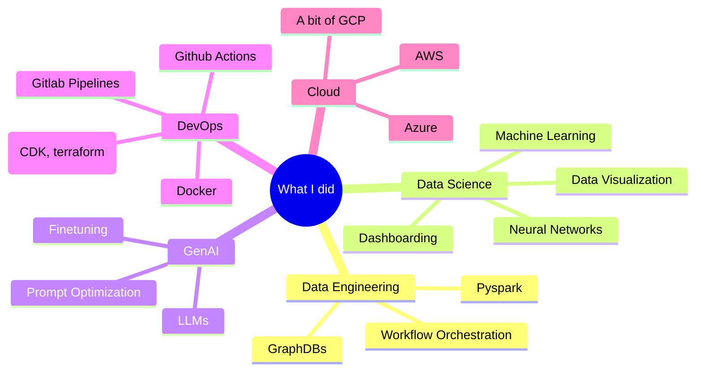

# Hi, I'm Stephan 👋

## About Me 🚀

I'm a passionate GenAI Architect and Data Engineer who loves to build AI and keey AI busy. My journey in tech has taken me through various domains including neural network development, data science, data engineering and cloud architecture (AWS and Azure mainly).

## My Tech Stack 💻

<table>
  <tr>
    <td align="center" width="96">
      
       Python
    </td>
    <td align="center" width="96">
      
       AWS
    </td>
    <td align="center" width="96">
      
       Spark
    </td> 
    <td align="center" width="96">
      
       Azure
    </td> 
    <td align="center" width="96">
      
       Docker
    </td>
    <td align="center" width="96">
      
       GitHub
    </td>
    <td align="center" width="96">
      
       Keras
    </td>
    <td align="center" width="96">
      
       Git
    </td>
    <td align="center" width="96">
      
       and more ...
    </td>
  </tr>
</table>

 

## Current Project 🔨

<table>
  <tr>
    <td width="50%" valign="top" align="center">
      <h3 align="center">Python Custom Agent</h3>
      

        
        

          
        

        
<strong>Tech Stack:</strong> Openai API, Python, Jupyter Notebook

      

    </td>
  </tr>
</table>

 

## Let's Connect 🤝

I'm always interested in collaborating on interesting projects or just chatting about tech. Feel free to reach out!

